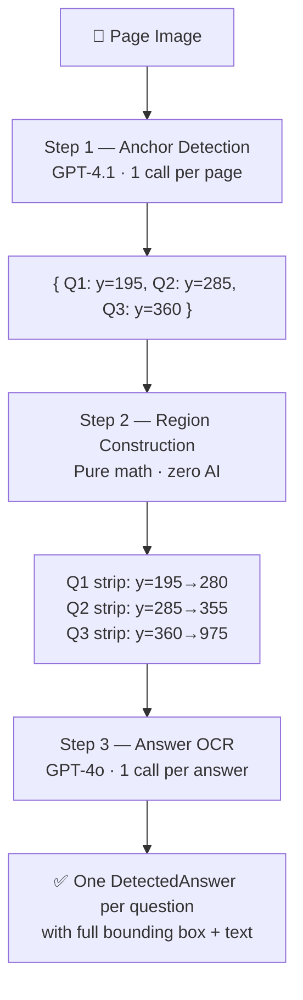

<div align="center">

# VedaAI

### AI-Powered Assessment Extraction & Answer Mapping

Upload a question paper + answer sheet → get questions extracted, answers detected, mapped, and graded — in seconds.

<br />

[](https://nextjs.org/)
[](https://www.typescriptlang.org/)
[](https://openai.com/)
[](https://tailwindcss.com/)
[](LICENSE)
[](https://github.com/akashissu/vedaAi)

<br />

[**Get Started**](#-quick-start) · [**See It in Action**](#-screenshots) · [**How It Works**](#-how-it-works) · [**API**](#-api-routes)

</div>

---

## Screenshots

<table>
  <tr>
    <td width="50%" align="center">
      <strong>Upload Screen</strong><br/><br/>
      
      <br/><sub>Drop your question paper & answer sheet — then hit Start Mapping</sub>
    </td>
  </tr>
</table>

---

## What It Does

<table>
  <tr>
    <td align="center" width="20%">📄<br/><strong>Upload</strong><br/><sub>PDF or image</sub></td>
    <td align="center" width="5%">→</td>
    <td align="center" width="20%">🔍<br/><strong>Extract</strong><br/><sub>Questions + marks</sub></td>
    <td align="center" width="5%">→</td>
    <td align="center" width="20%">🎯<br/><strong>Detect</strong><br/><sub>Answer regions</sub></td>
    <td align="center" width="5%">→</td>
    <td align="center" width="20%">🔗<br/><strong>Map</strong><br/><sub>Q ↔ Answer</sub></td>
    <td align="center" width="5%">→</td>
    <td align="center" width="20%">✅<br/><strong>Grade</strong><br/><sub>AI feedback</sub></td>
  </tr>
</table>

---

## Key Features

<table>
  <tr>
    <td width="50%" valign="top">

### 🎯 Precise Answer Detection
3-step hybrid pipeline — not line-level OCR boxes, but **one semantic box per answer**.

| Step | What | How |
|:--:|:--|:--|
| **1** | Find answer start | GPT-4.1 locates where each "Ans." begins |
| **2** | Build regions | Pure math — full-height strips between anchors |
| **3** | Transcribe | GPT-4o OCR on cropped single-answer image |

</td>
    <td width="50%" valign="top">

### ⚡ Everything Else
| Feature | Detail |
|:--|:--|
| 📑 **Multi-page PDFs** | Full support for multi-page documents |
| 📡 **Live progress** | Real-time SSE streaming during processing |
| 🎨 **Visual overlays** | Color-coded boxes — 🟢 correct · 🔴 wrong |
| 🤖 **AI grading** | Per-question or Grade All with feedback |
| ⚡ **Fast setup** | No database — in-memory sessions, 30-min TTL |

</td>
  </tr>
</table>

---

## How It Works

### The Problem We Solved

<table>
  <tr>
    <td width="50%" align="center">
      <strong>❌ Before — Line-level OCR</strong><br/><br/>
      <pre>
Q8  ┌─────────────────────┐
Q9  ┌──────────────────────────┐
Q10 ┌───────────────────────────┐
      </pre>
      <sub>Many thin boxes on individual text lines</sub>
    </td>
    <td width="50%" align="center">
      <strong>✅ After — Semantic Answer Blocks</strong><br/><br/>
      <pre>
      Q2
┌────────────────────────────────────┐
│ The process mainly occurs in the   │
│ chloroplast...                     │
│ 1. Light reaction                  │
│ 2. Dark reaction                   │
└────────────────────────────────────┘
      </pre>
      <sub>One full box per answer — multi-line, diagrams included</sub>
    </td>
  </tr>
</table>

### 3-Step Pipeline



<details>
<summary><strong>📖 Why this beats single-call detection</strong></summary>

<br />

| | Single AI call | 3-Step Hybrid |
|:--|:--|:--|
| Box precision | Thin single-line strips | Full-height answer blocks |
| Question text included | Often yes | Never — starts at "Ans." line |
| Multi-line answers | Missed lines | All lines included |
| Handwriting | Unreliable | Cropped per-answer OCR |
| Diagrams in answers | Ignored | Included in strip region |

</details>

---

## Quick Start

### 1. Clone & Install

```bash
git clone https://github.com/akashissu/vedaAi.git
cd vedaAi
npm install
```

### 2. Configure Environment

```bash
cp .env.example .env.local
```

```env
OPENAI_API_KEY=sk-your-actual-key-here
NEXT_PUBLIC_APP_URL=http://localhost:3000

OPENAI_MODEL=gpt-4o
OPENAI_VISION_MODEL=gpt-4o
OPENAI_DETECTION_MODEL=gpt-4.1
```

### 3. Run

```bash
npm run dev
```

Open **http://localhost:3000** → upload both files → click **Start Mapping**

<details>
<summary><strong>📋 All environment variables</strong></summary>

<br />

| Variable | Default | Description |
|:--|:--|:--|
| `OPENAI_API_KEY` | — | **Required** — your OpenAI API key |
| `OPENAI_MODEL` | `gpt-4o` | Question extraction & grading |
| `OPENAI_VISION_MODEL` | `gpt-4o` | Answer OCR (Step 3) |
| `OPENAI_DETECTION_MODEL` | `gpt-4.1` | Anchor detection (Step 1) |
| `MAX_FILE_SIZE_MB` | `20` | Max upload file size |
| `SESSION_TTL_MINUTES` | `30` | Session expiry |
| `NEXT_PUBLIC_APP_URL` | `http://localhost:3000` | App base URL |

</details>

---

## How to Use

```
┌─────────────────────────────────────────────────────────┐
│  1. Upload Question Paper    (PDF or image, max 10MB)   │
│  2. Upload Answer Sheet      (PDF or image, max 10MB)   │
│  3. Click "Start Mapping"    (~15–30 seconds)           │
│  4. Browse results           → Q-labels on answer boxes  │
│  5. Grade                    → per question or all at once│
└─────────────────────────────────────────────────────────┘
```

---

## Tech Stack

<table>
  <tr>
    <td align="center"><strong>Frontend</strong><br/>Next.js 14 · React · TypeScript · Tailwind</td>
    <td align="center"><strong>AI</strong><br/>GPT-4.1 (detection) · GPT-4o (OCR + grading)</td>
    <td align="center"><strong>PDF</strong><br/>pdfjs-dist · @napi-rs/canvas</td>
  </tr>
  <tr>
    <td align="center"><strong>UI</strong><br/>shadcn/ui · Radix primitives</td>
    <td align="center"><strong>Streaming</strong><br/>Server-Sent Events (SSE)</td>
    <td align="center"><strong>Deploy</strong><br/>Vercel · Fluid Compute</td>
  </tr>
</table>

---

## API Routes

| Endpoint | Method | Description |
|:--|:--:|:--|
| `/api/upload` | `POST` | Upload question paper or answer sheet |
| `/api/process` | `GET` | Start AI pipeline · streams progress via SSE |
| `/api/results` | `GET` | Fetch processed results for a session |
| `/api/grade` | `POST` | Grade a single question with AI feedback |
| `/api/page-image` | `GET` | Serve a rendered page image |

---

## Project Structure

<details>
<summary><strong>📁 Full folder tree</strong></summary>

<br />

```
vedaai/
├── app/
│   ├── api/
│   │   ├── upload/          POST — file upload & validation
│   │   ├── process/         GET  — main AI pipeline (SSE)
│   │   ├── results/         GET  — fetch processed results
│   │   ├── page-image/      GET  — serve page images
│   │   └── grade/           POST — grade single question
│   ├── page.tsx             Main UI state machine
│   └── layout.tsx
│
├── components/
│   ├── upload/              UploadScreen
│   ├── processing/          ProcessingScreen
│   ├── results/             ResultsScreen (PDF + bounding boxes)
│   └── layout/              Sidebar · TopBar
│
├── lib/
│   ├── detection.ts         ⭐ 3-step answer detection pipeline
│   ├── extraction.ts        Question extraction
│   ├── mapping.ts           Q ↔ Answer mapping
│   ├── grading.ts             AI grading & feedback
│   ├── pdf-utils.ts         PDF → image conversion
│   ├── openai-client.ts     OpenAI singleton + retry
│   ├── prompts.ts           All AI prompt templates
│   └── store.ts             In-memory session store
│
├── docs/screenshots/        App screenshots
├── skills/                  AI skill definitions
├── guardrails/              Safety policies
└── orchestrator/            Pipeline docs
```

</details>

---

## Development

```bash
npm run dev          # Start dev server (port 3000)
npm run build        # Production build
npm run typecheck    # TypeScript check
npm run lint         # ESLint
npm test             # Run tests
```

---

## Known Limitations

| Limitation | Workaround |
|:--|:--|
| Sessions are in-memory | Restart clears sessions — re-upload to continue |
| Large PDFs (20+ pages) | Use Vercel Fluid Compute or process in chunks |
| Handwritten sheets | Works best when answers have clear question numbers |

---

<div align="center">

**Built for teachers who want AI to do the tedious part.**

<br />

MIT License · [Report an Issue](https://github.com/akashissu/vedaAi/issues) · [View Docs](./ARCHITECTURE.md)

</div>
